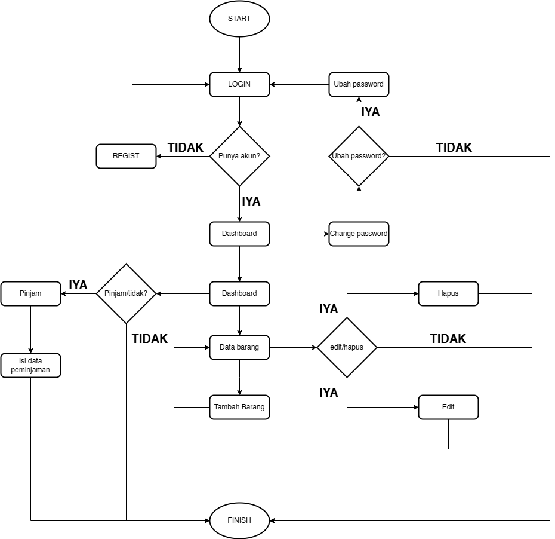

# Flask Inventory UMKM

Sistem manajemen inventaris berbasis Flask untuk mengelola barang dengan lebih akurat, mudah untuk proses pengadaan dan pengelolaan stock.

- User-Friendly Dashboard: A clean to view inventory statistics at a glance.
- CRUD Operations: Easily add, update, or remove items from the inventory.
- Borrow Management: Track items that are currently borrowed and manage their status.


## Features

✅ **Authentication**: User login & registration  
✅ **Item Management**: Add, edit, delete, and view items  
✅ **Item Status**: Update loaned item status  
✅ **Dashboard**: Display borrowed items  

# Our Team

- Bayu Ade          (2213010496)
- M. reno           (2213010493)
- Yasir Galuh       (2213010482)
- Anggi Susanti     (2213010502)

## Technologies Used

- Python (Flask)  
- SQLite/MySQL  
- Bootstrap (for UI)  

## Flowchart



## Link Dokumentasi

[Watch the video on YouTube](https://youtu.be/0HCdrFM5Nas)

## Installation & Configuration

### 1. Clone this repository
```bash
git clone https://github.com/kampusriset/22i_flask_inventory_umkm.git
cd 22i_flask_inventory_umkm
```

### 2. Create a Virtual Environment & Install Dependencies
```bash
python -m venv env  
source env/bin/activate  # Mac/Linux  
env\Scripts\activate     # Windows  
pip install -r requirements.txt  
```

### 3. Run the Application
```bash
flask run
```
Access the application at **http://127.0.0.1:5000/**

## Directory Structure

```
22i_flask_inventory_umkm/
│── env/                     # Virtual Environment
│── static/                   # Static files (CSS, JS, images)
│── templates/                # HTML templates
│── models.py                 # Database model
│── controllers.py            # Routing & logic
│── app.py                    # Application entry point
│── requirements.txt          # Project dependencies
│── README.md                 # This documentation
```

## Additional Notes

- Ensure `database.db` is created before running the application  
- Use `.env` to store sensitive configuration such as secret keys  

## Contact & Contribution

💡 Want to contribute? Fork, create a new branch, make changes, and submit a Pull Request!  
📩 Email: your@email.com  
🌎 GitHub: [@username](https://github.com/username)  
